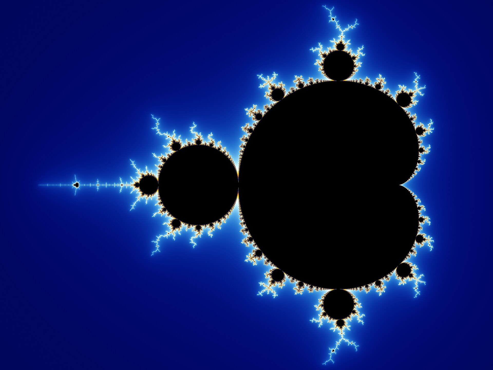

# Maths and Science

The discoveries that changed how we see reality.

## In mathematics

The Mandelbrot set above comes from one of the simplest equations there is, z becomes z
squared plus c. Zoom in as far as you like and you never run out of new detail. It is the
best-known example of fractal geometry, which turned out to describe coastlines, lungs,
blood vessels and even market crashes.

Zero was worked out in India by Brahmagupta in the 7th century. Without it there is no
algebra, no calculus and no computers, which makes it one of the most important ideas in
maths.

In 1931 Kurt Godel proved that in any consistent mathematical system there are true
statements that can never be proven inside it. Maths proved its own limits.

And Euler's identity ties five fundamental constants together in one line:

`e^(iπ) + 1 = 0`

## In science

Einstein's relativity showed that time runs slower when you move fast or sit deep in
gravity. This is not just theory. Your phone's GPS corrects for it every second, or the
maps would drift about 10 km a day.

Quantum mechanics says that at the smallest scales, particles can be in several states at
once until measured, and can be entangled, so that measuring one instantly affects the
other at any distance. Einstein hated this and called it spooky action at a distance.
Experiments keep proving it right.

DNA, worked out in 1953, encodes every living thing in four letters. We went from finding
its structure to editing it with CRISPR in a single lifetime.

Germ theory, the idea that invisible organisms cause disease, arrived in the 1860s. Before
that, surgeons did not wash their hands and surgery was often a death sentence. That one
idea has probably saved more lives than any other.

One thing to notice: nearly every discovery here was resisted at first. Semmelweis was
mocked for suggesting handwashing. Big ideas tend to look wrong before they look obvious.
