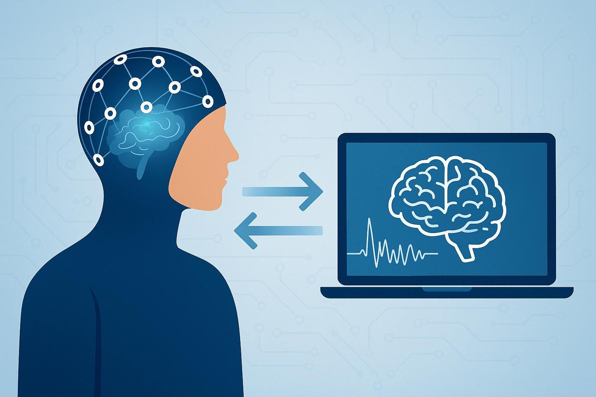
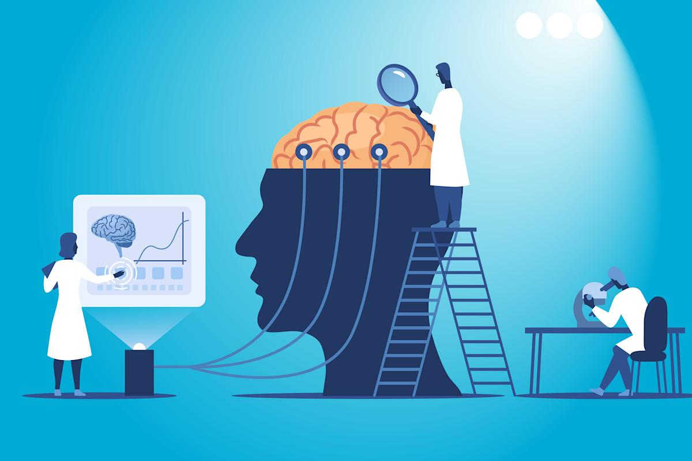

# Mind and Beyond

Telepathy, telekinesis, teleportation and psychology. The line between science fiction and
the lab is moving faster than most people think, so it is worth being clear about what is
real and what isn't.

## Telepathy, mind to mind

The dream is sending thoughts straight from one mind to another.

What already exists: brain-computer interfaces. Companies like Neuralink and Synchron, and
several university labs, have put chips in people that let them type, move a cursor and
control a robotic arm just by thinking. In 2014 a person in India sent the words "hola" and
"ciao" to a person in France using only a brain-reading cap and magnetic stimulation. It
was crude and slow, but it happened. More recently, AI models have reconstructed sentences
people were only imagining from brain scans.

Where it stands honestly: natural telepathy has never held up in a controlled experiment.
But the technological version is now an engineering problem, not a fantasy.

## Telekinesis, mind over matter

The dream is moving objects with the mind.

What already exists: thought-controlled prosthetic limbs, wheelchairs and drones. A
paralyzed person lifting a cup with a robot arm driven by their own brain signals is
telekinesis with wires filling in the gap.

Where it stands honestly: there is no evidence a mind can push matter directly. Every lab
claim, spoon bending included, has fallen apart under proper conditions. The engineered
version, though, is already changing lives.

## Teleportation

What already exists: quantum teleportation. The state of a particle has been transferred to
another particle over 1,200 km by satellite (China, 2017). This is real, repeatable physics.

The catch: it moves information, not matter, and the original state is destroyed in the
process. Teleporting a person would mean scanning something like 10^28 atoms, and it raises
a hard question. Would the person who arrives still be you? That is the Ship of Theseus
problem, which the [philosophy](philosophy.md) page gets into.

## Psychology, how the mind actually works

The most useful frontier here, because you use it every day.

The brain rewires itself throughout life. Skills, habits and even recovery from injury are
physical rewiring, so you are always under construction. There are also more than 180
documented ways the mind fools itself, like confirmation bias and the sunk cost fallacy,
and people who know their own biases tend to make better decisions. There is flow, the deep
focus where performance peaks and time seems to vanish, which shows up when the challenge
sits just above your skill level. And there is the placebo effect, where belief alone
produces measurable healing, which is biochemical rather than mystical.

The honest takeaway: stay curious about everything, but ask for evidence. The real
advantages are not paranormal. They are neuroplasticity, focus, and the willingness to keep
learning. And the engineered versions of telepathy and telekinesis are arriving within our
lifetime.
