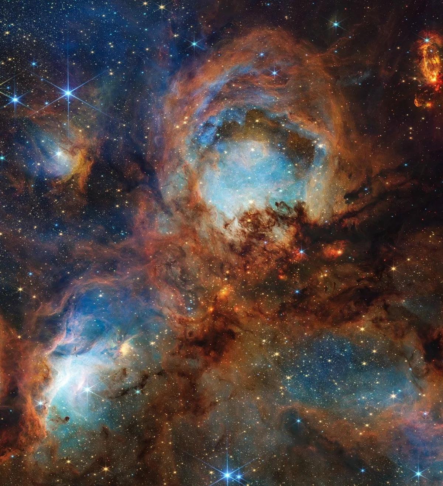
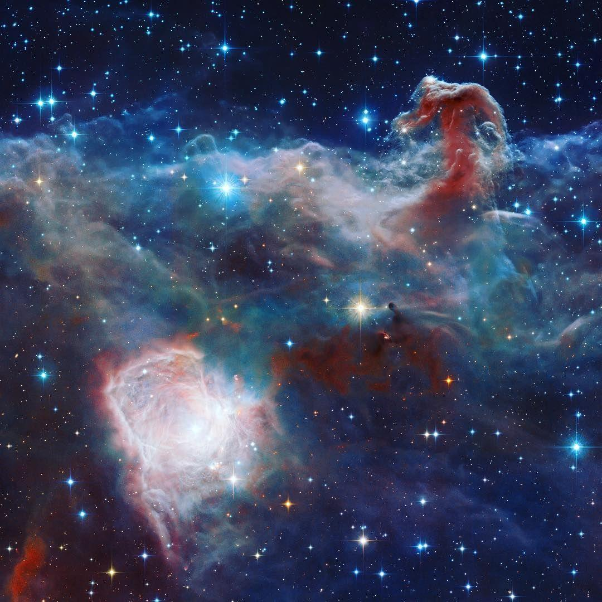
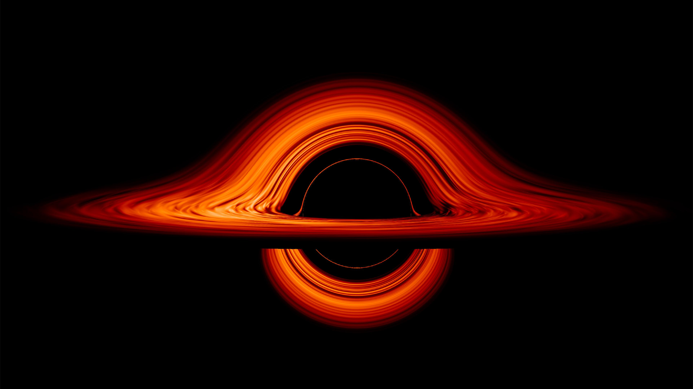

# Space

Notes on the universe above us.

## Numbers that are hard to take in

The observable universe holds something like 2 trillion galaxies, each with hundreds of
billions of stars. There are more stars out there than grains of sand on every beach on
Earth. A neutron star is so dense that a teaspoon of it would weigh about 4 billion tonnes.

## What is happening right now

Reusable rockets have brought the cost of reaching orbit down a lot, from around $65,000
per kilo on the Space Shuttle toward roughly $1,500 on the Falcon 9, with Starship aiming
lower still. Cheap access to orbit changes almost everything about what we can do in space.

The first exoplanet was confirmed in 1992. We now know of more than 5,000 planets around
other stars, and the James Webb telescope is reading their atmospheres for signs of life.
We might detect life through chemistry before we ever pick up a signal.

In 2015 we detected gravitational waves for the first time: ripples in spacetime from two
black holes colliding, measured by an instrument sensitive to a movement thousands of times
smaller than a proton.

## A few more things worth reading up on

Black holes, where gravity is strong enough that not even light escapes. We have now
photographed two of them, M87 in 2019 and our own galaxy's centre in 2022. NASA and ESA
missions like Artemis, Europa Clipper and the Voyager probes still going after 45 years.
And the plain human side of it: astronauts, from Gagarin's first orbit to a full year on
the station.

## Still open

The biggest space questions, dark matter, dark energy and whether we are alone, are covered
in [Unsolved: Space](../unsolved/space.md).

> The Earth is the cradle of humanity, but one cannot live in a cradle forever.
> Konstantin Tsiolkovsky, 1911
