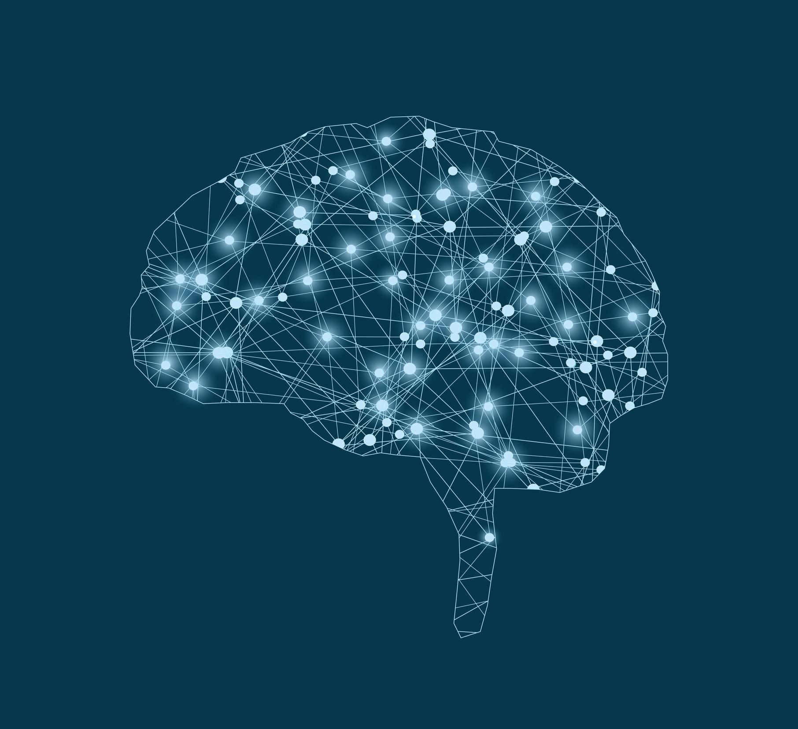
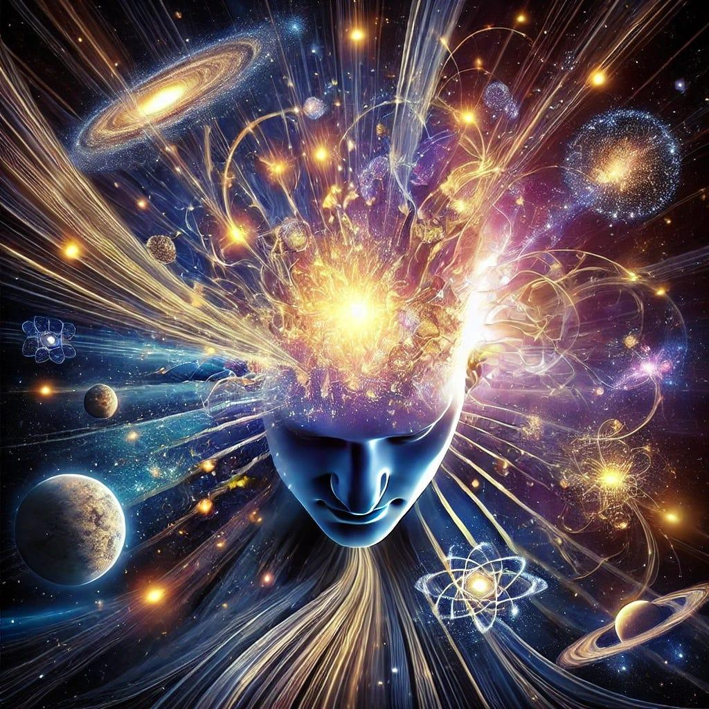

# Unsolved: The Brain

| Problem | Status | Difficulty |
|---------|--------|------------|
| What is consciousness? | Unsolved | Very hard |
| Can lost memories be restored? | Early research | Hard |
| Cure Alzheimer's | Active progress | Very hard |
| Cure Parkinson's | Active progress | Hard |
| Why do we dream? | Early research | Hard |
| High-bandwidth brain interfaces | Active progress | Hard |
| Reading thoughts safely | Early research | Hard |
| Enhancing intelligence | Early research | Very hard |
| A complete brain map | Active progress | Very hard |
| How mental illness works | Early research | Very hard |

### What is consciousness?

Status: Unsolved · Difficulty: Very hard

This is about as deep as questions go. Why does information processing feel like anything
from the inside? The answer shapes how we treat animals, people in comas, and possibly AI.

Current approaches: competing theories like Integrated Information Theory and Global
Workspace Theory, and experiments designed to make those theories fight. A big head-to-head
study reported in 2023 left both looking incomplete.

Why it's still open: even a full wiring diagram of the brain would not obviously explain why
experience exists at all. This is what philosophers call the hard problem.

Timeline: there is no agreement on whether it is even solvable.

Related: [AI consciousness](ai.md), how anesthesia works, dreams.

### Cure Alzheimer's

Status: Active progress · Difficulty: Very hard · grand challenge #7

More than 55 million people live with dementia, and that number will roughly triple by 2050
as populations age. It erases the person before it takes the body.

Current approaches: anti-amyloid antibodies like lecanemab and donanemab, which are the first
drugs shown to slow the disease and were approved in 2023 and 2024, plus blood tests for
early diagnosis and drugs that target tau.

Why it's still open: by the time symptoms show, the brain has been under attack for around 20
years, and the leading theory explains some cases but not all.

Latest: blood tests that pick up Alzheimer's years before symptoms are rolling out in the
mid-2020s, which makes early treatment realistic.

Timeline: slowing it, now. Prevention, the 2030s. Reversal, unknown.

### A complete brain map

Status: Active progress · Difficulty: Very hard

The brain has 86 billion neurons and something like 100 trillion connections. Mapping them
is to neuroscience what the genome was to biology.

Latest: the full fruit-fly brain, about 140,000 neurons, was finished in 2024. A cubic
millimetre of human cortex was mapped the same year and took 1.4 petabytes of data.

Why it's still open: a whole human brain at that resolution would need more storage than
currently exists on Earth, so we need new imaging and compression first.

Related: [brain interfaces](../knowledge/mind.md), how mental illness works.
