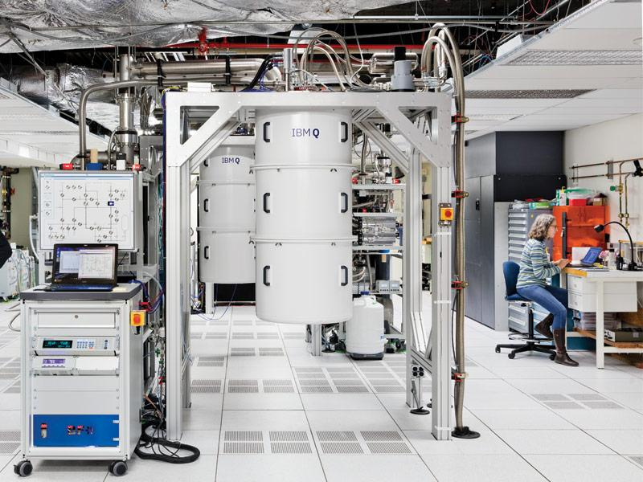

# Unsolved: Computing

| Problem | Status | Difficulty |
|---------|--------|------------|
| Practical quantum computers | Active progress | Very hard |
| Fault-tolerant quantum systems | Early research | Very hard |
| Post-quantum security | Active progress | Hard |
| Energy-efficient computing | Active progress | Hard |
| Exascale AI infrastructure | Mostly solved | Hard |
| Secure digital identity | Early research | Hard |
| Global internet access | Active progress | Medium |
| Data privacy at scale | Early research | Hard |
| Zero-trust security | Active progress | Medium |
| A quantum internet | Early research | Very hard |

### Practical quantum computers

Status: Active progress · Difficulty: Very hard · grand challenge #12

Quantum computers could crack problems ordinary machines never will, like designing drugs and
materials atom by atom and modelling chemistry exactly.

Current approaches: superconducting qubits at IBM and Google, trapped ions at Quantinuum,
photonics, and neutral atoms. No clear winner yet, and error correction is the central race.

Why it's still open: qubits are fragile and lose their quantum state in microseconds, so
errors pile up fast. Useful work needs thousands of stable logical qubits built from millions
of physical ones.

Latest: Google's 2024 Willow chip showed error rates that fall as the system grows, which is
a key sign that fault tolerance is reachable.

Timeline: useful, error-corrected machines for narrow problems in the early-to-mid 2030s.

Related: fault-tolerant systems, post-quantum security, a quantum internet.

### Post-quantum security

Status: Active progress · Difficulty: Hard

A large quantum computer would break most of the encryption protecting today's internet,
banking and secrets. Some adversaries may already be storing encrypted data now to decrypt
it later.

Current approaches: new quantum-resistant algorithms. The US standards body NIST published
its first set in 2024, and a worldwide migration is starting.

Why it's still open: swapping out encryption across every device, protocol and system on
Earth is a decade-long job that has to finish before quantum computers mature.

### A quantum internet

Status: Early research · Difficulty: Very hard

A network built on quantum entanglement would be unhackable by the laws of physics, and would
link quantum computers together.

Latest: entanglement has been sent across city-scale fibre networks and by satellite, through
China's Micius, and small multi-node quantum networks now exist.

Why it's still open: entanglement is fragile over distance, and the quantum equivalent of a
signal booster, a quantum repeater, is still immature.
