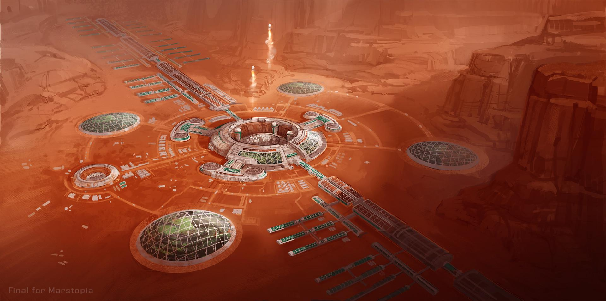
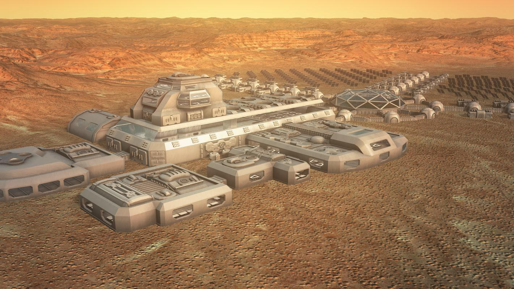

# Unsolved: Future Humanity

| Problem | Status | Difficulty |
|---------|--------|------------|
| A self-sustaining Mars colony | Early research | Very hard |
| Lunar cities | Early research | Very hard |
| Asteroid mining | Early research | Hard |
| Cryopreservation and revival | Unsolved | Very hard |
| Mind uploading | Unsolved | Very hard |
| Synthetic biology | Active progress | Hard |
| Living well past 120 | Early research | Very hard |
| Terraforming planets | Unsolved | Very hard |
| Space manufacturing | Active progress | Hard |
| Civilization resilience | Early research | Very hard |

### Lunar cities

Status: Early research · Difficulty: Very hard

The Moon is a three-day trip away, a proving ground for Mars, and a source of water ice for
fuel. A permanent base is the realistic first step to living off Earth.

Current approaches: NASA's Artemis program, which aims to return crews this decade, a planned
station in lunar orbit, and research into building with lunar dust so you do not have to ship
everything from Earth.

Why it's still open: lunar dust is razor-sharp and gets into everything, the 14-day night
needs stored power, there is no atmosphere to block radiation, and the cost is huge.

Timeline: a small research base in the 2030s. An actual city is a multi-decade goal.

Related: a Mars colony, space manufacturing, asteroid mining.

### Synthetic biology

Status: Active progress · Difficulty: Hard

Engineering biology like software lets us program cells to make medicines, food, fuels and
materials, even organisms that never existed in nature.

Current approaches: engineered microbes already produce insulin, spider silk and fragrances,
a synthetic minimal cell was built with just 473 genes, and DNA is being used as a way to
store data.

Why it's still open: biology is messy and hard to predict, engineered organisms behave
differently outside the lab, and there are real biosafety and biosecurity concerns.

Related: regrow organs and reverse aging on the [medicine](medicine.md) page.

### Mind uploading

Status: Unsolved · Difficulty: Very hard

Copying a mind into a computer would redefine death, identity and what it means to be human.

Why it's still open: we cannot yet map a single human brain, as the [brain](brain.md) page
covers, we do not understand consciousness, and even a perfect copy raises the Ship of Theseus
question from the [philosophy](../knowledge/philosophy.md) page. Would the upload be you, or a
copy that only thinks it is?

Timeline: deeply speculative, and not this century on current science.
