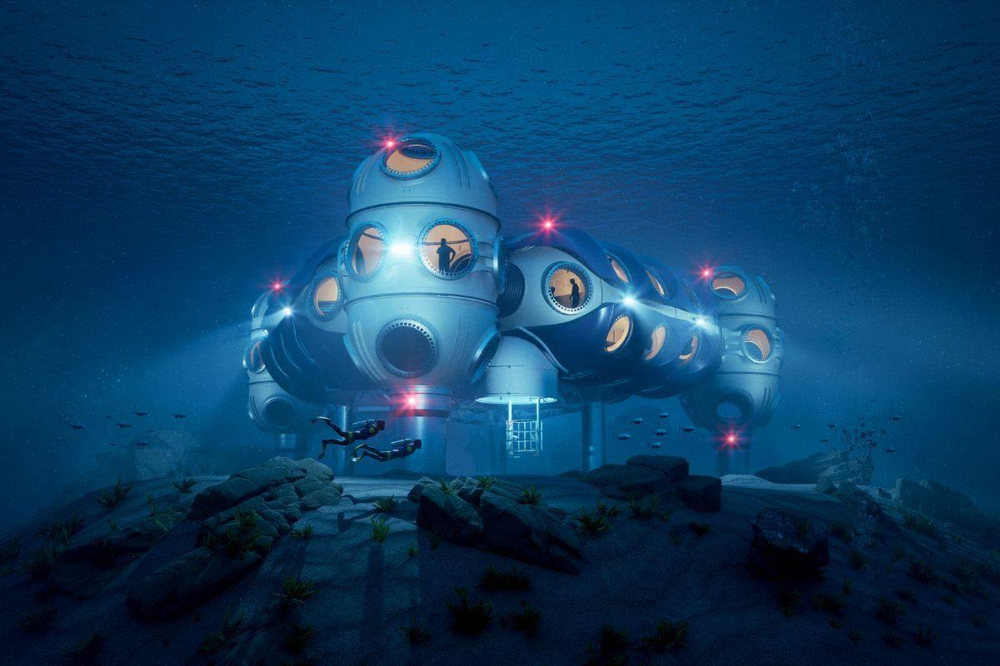
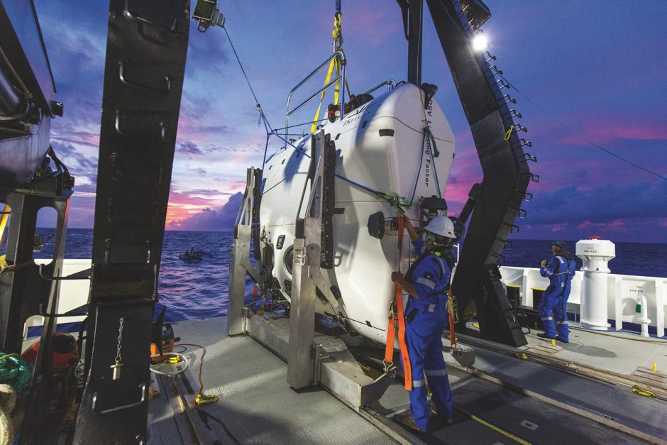
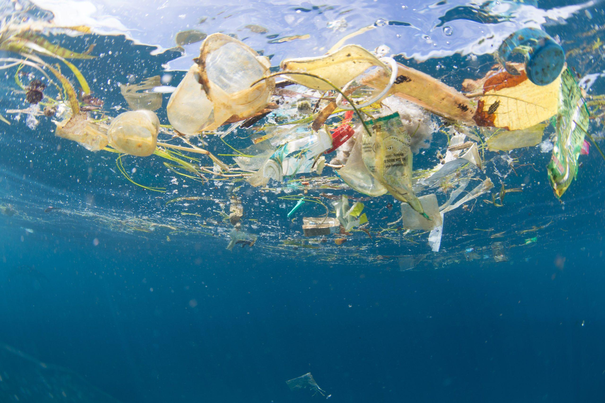

# Unsolved: Oceans

| Problem | Status | Difficulty |
|---------|--------|------------|
| Mapping the whole ocean floor | Active progress | Medium |
| Cleaning up ocean plastic at scale | Early research | Hard |
| Predicting rogue waves | Active progress | Medium |
| Cataloguing deep-sea life | Early research | Hard |
| Ocean farming at scale | Active progress | Medium |
| Restoring coral reefs | Active progress | Hard |
| Ocean carbon removal | Early research | Hard |
| Reliable tsunami prediction | Active progress | Hard |
| Underwater habitats | Unsolved | Very hard |

### Mapping the whole ocean floor

Status: Active progress · Difficulty: Medium · grand challenge #10

We cannot protect or understand what we have never seen, and the shape of the sea floor
drives tsunamis, currents and climate.

Current approaches: the Seabed 2030 project coordinates ships and autonomous underwater
drones worldwide, with satellite data filling gaps at low resolution.

Why it's still open: the ocean is opaque to radar, so mapping means physically sending sound
waves from ships or drones across 360 million square kilometres. Slow and expensive.

Latest: coverage rose from about 6% in 2017 to over 25% by the mid-2020s, mostly thanks to
autonomous vessels.

Timeline: a complete first-pass map is possible in the 2030s if funding holds.

### Cleaning up ocean plastic at scale

Status: Early research · Difficulty: Hard

About 8 million tonnes of plastic reach the ocean each year, and microplastics now show up
in rain, food and human blood.

Current approaches: catching plastic at rivers before it reaches the sea, which is the
cheapest point of leverage since a small number of rivers carry much of the flow, plus
open-ocean systems, plastic-eating enzymes, and cutting plastic use upstream.

Why it's still open: once microplastics disperse they are effectively impossible to recover,
and any cleanup has to beat the rate of new plastic coming in.

Timeline: river interception can scale this decade. The legacy plastic already in the open
ocean is a 50-year-plus problem.

Related: plastic alternatives, sustainable packaging.

### Predicting rogue waves

Status: Active progress · Difficulty: Medium

Walls of water 20 to 30 metres high can appear without warning and have sunk ships built to
survive any storm. They were dismissed as sailors' myth until one was measured directly at
the Draupner platform in 1995.

Current approaches: AI models trained on wave-buoy data can now flag the conditions that
breed rogue waves minutes to hours ahead.

Why it's still open: these waves come from nonlinear interactions that amplify chaotically,
so tiny measurement errors wreck the forecast.

Latest: machine-learning models from 2023 onward predict rogue-wave risk noticeably better
than physics-only models.
