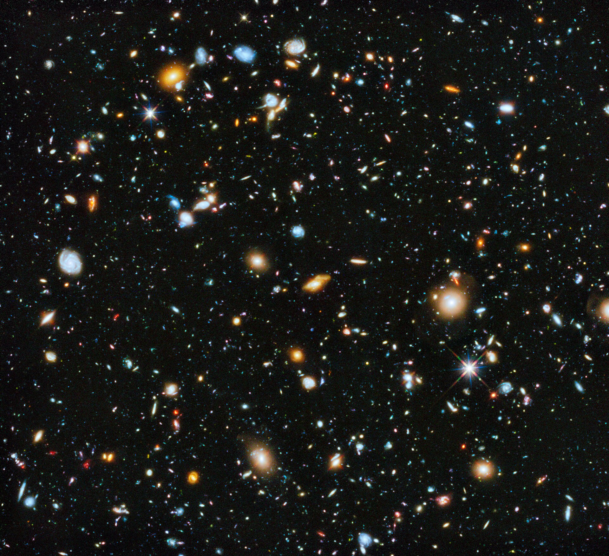

# Tekmaturix

Most sites collect what we already know. This one also keeps track of what we don't: the
big problems in science, technology and society that nobody has cracked yet, and where
each one currently stands.

I built it as a place to store the things I find worth knowing, and to keep an honest
map of the questions still open.

## Where the name comes from

Tek (𒆳) is old shorthand for technology and knowledge. Matu (𒁍) stands for courage and
not giving up. Rix comes from Latin, for a leader or ruler. Put together it is roughly:
know things, keep going, and build.

## Start here

[Browse the unsolved problems](unsolved/index.md){ .md-button .md-button--primary }

- :material-help-circle: [Unsolved](unsolved/index.md)

    Humanity's open problems, from dark matter to AI safety, each tagged with how far along we are.

- :material-lightbulb-on: [Innovations](innovations/index.md)

    Real problems and the approaches people are trying, plus a running log of my own ideas.

- :material-book-open-variant: [Knowledge](knowledge/index.md)

    Twelve areas I keep notes on: space, oceans, the brain, medicine, engineering and more.

- :material-rocket-launch: [Space](knowledge/space.md)

    Black holes, exoplanets, what the James Webb telescope is finding, and the search for life.

- :material-waves: [Oceans](knowledge/oceans.md)

    The 80% of the sea floor we have never mapped, and the life down there.

- :material-head-lightbulb: [Mind and beyond](knowledge/mind.md)

    Telepathy, telekinesis, teleportation: what is real, what isn't, and the psychology behind it.

