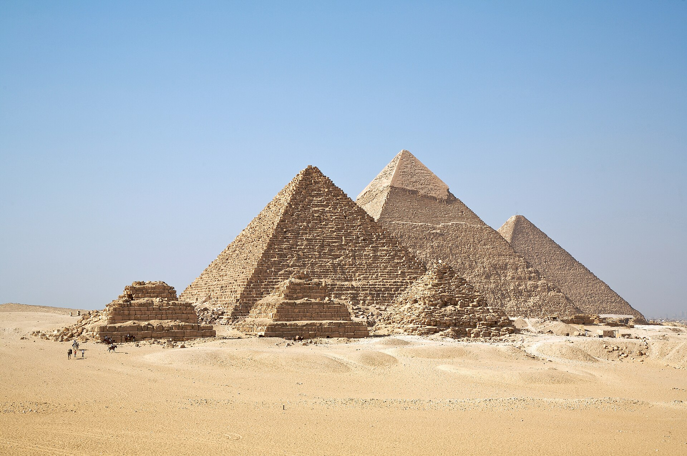

# Ancient Civilizations and History

The past is stranger, and often more advanced, than we tend to assume.

## Old engineering that still puzzles us

The Great Pyramid was built around 2,560 BCE from about 2.3 million blocks averaging 2.5
tonnes each, and it is aligned to true north within a fraction of a degree. It stayed the
tallest structure on Earth for 3,800 years, and exactly how it was built is still argued
over.

Roman harbour concrete has lasted 2,000 years in seawater and actually gets stronger over
time, while modern concrete crumbles in decades. Researchers only recently worked out the
self-healing chemistry behind it, which involves mixing in lime while hot.

The Antikythera mechanism is a bronze geared device from around 100 BCE, pulled from a Greek
shipwreck, that predicted eclipses and planetary positions. Nothing this complex shows up
again for about 1,400 years.

## Lost cities and open mysteries

Gobekli Tepe in Turkey is a set of monumental stone temples built roughly 11,000 years ago,
before farming, pottery or the wheel, which pushed back the timeline of civilization. The
Indus Valley cities had grid streets and plumbing 4,500 years ago, and their writing still
has not been deciphered. In the Amazon, LiDAR scans are revealing large lost cities under
the canopy, overturning the idea that the rainforest was untouched.

Some questions are still open. What actually caused the Bronze Age collapse around 1200 BCE,
when several civilizations fell at once? Who were the Sea Peoples? How were the Nazca Lines
designed to be seen only from the air?

Every civilization we call primitive turns out to be cleverer than we assumed, which is
decent training for staying humble about the future too.
