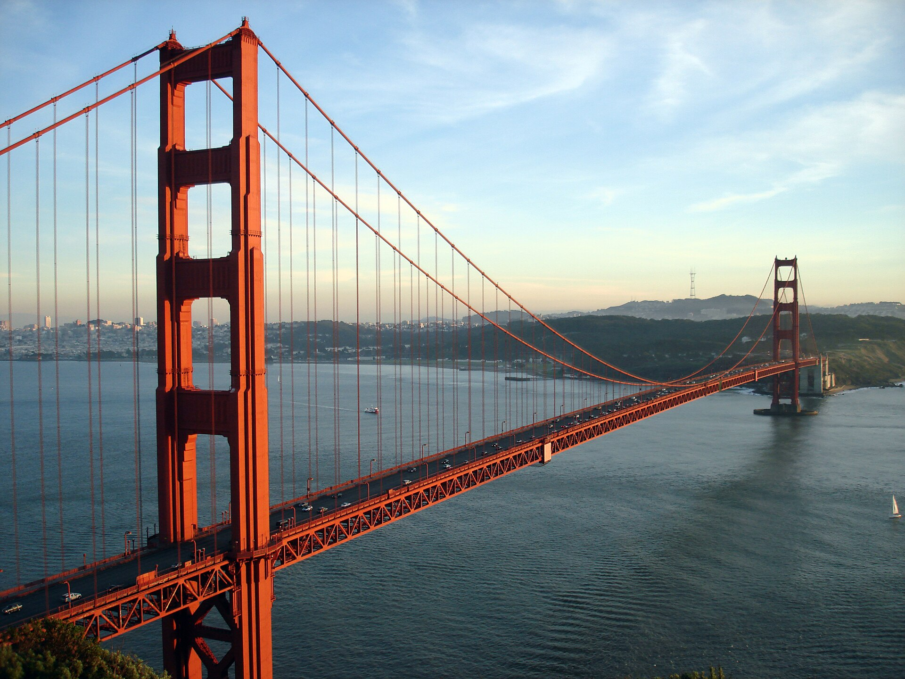

# Engineering Wonders

What people can build when ambition meets the maths.

The Golden Gate was called impossible before it opened in 1937. Today the Akashi Kaikyo
Bridge in Japan spans about 2 km in a single leap and is built to ride out a magnitude-8
earthquake and typhoon winds.

The Burj Khalifa rises 828 metres, half a mile, into the sky. Its buttressed core and
tapering shape let it stand up to wind that would topple a simpler tower. The next
generation aims for a full kilometre.

The jet engine turned the planet into somewhere you can cross in hours. A modern airliner
has around 4 million parts and flies at 900 km/h, 12 km up, safely, thousands of times a day.

The Saturn V is still the most powerful machine ever flown: 3,000 tonnes and 7.5 million
pounds of thrust, sending people to the Moon with less computing power than a modern
calculator. Starship is now the largest rocket ever built.

The Three Gorges Dam produces about as much power as 20 nuclear reactors, and the Hoover Dam
still holds back the Colorado River after nearly a century.

Japan's Shinkansen has carried billions of passengers since 1964 with a near-perfect safety
record and delays measured in seconds. Maglev prototypes have passed 600 km/h.

The Gotthard Base Tunnel runs 57 km straight through the Alps, and the Channel Tunnel links
Britain and France beneath the sea.

And the International Space Station is a 420-tonne laboratory assembled in orbit from modules
built by 15 nations, lived in continuously since 2000.

Every one of these was too big, too expensive or too dangerous, until the engineering caught
up with the ambition. The next ones are in
[Unsolved: Engineering](../unsolved/engineering.md).
