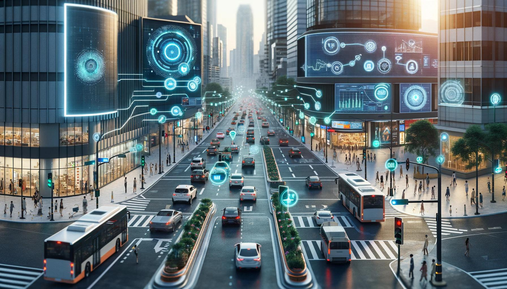
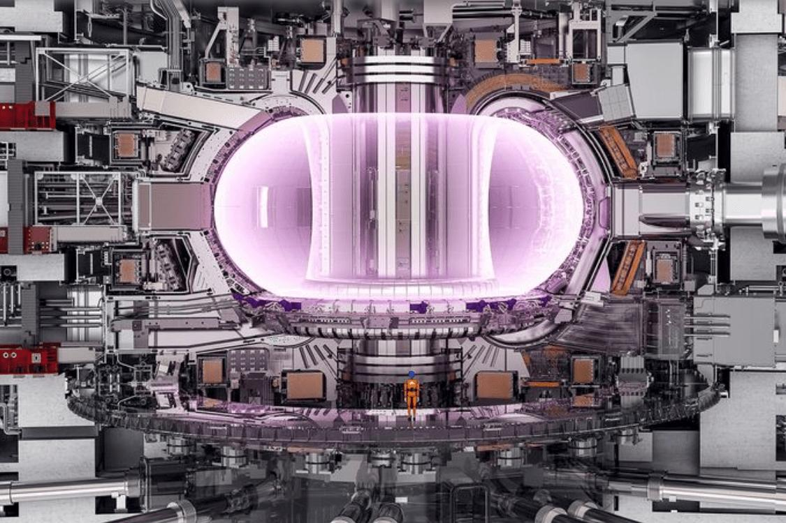

# Future Technology

The tools that will shape the next 50 years. Some are already in labs, some are just
leaving them.

## Artificial intelligence
Machines that learn, reason and create. AlphaFold worked out protein structures that
biologists had chased for 50 years. The open questions, alignment, consciousness and AGI,
are in [Unsolved: AI](../unsolved/ai.md).

## Robotics
General-purpose humanoid robots are leaving the lab, from Figure and Tesla to Boston
Dynamics. The body was never the hard part. The brain is: handling the messy, unpredictable
real world.

## Quantum computing
Computers that use quantum states to solve problems ordinary machines can't, like drug
design and materials. Still fragile and error-prone. See
[Unsolved: Computing](../unsolved/computing.md).

## Fusion energy
The power source of the stars, on Earth. In 2022 a reaction released more energy than the
fuel absorbed for the first time. Limitless clean power if we can make it continuous and
cheap. See [Unsolved: Earth](../unsolved/earth.md).

## Brain-computer interfaces
Chips that let the mind control machines directly. They are already restoring movement and
speech to paralyzed people. This is the engineered version of telepathy, covered on the
[mind](mind.md) page.

## Nanotechnology
Building at the scale of atoms: drug delivery that targets cancer cells, self-cleaning
surfaces, stronger materials, and one day molecular machines.

## Future transport
Reusable rockets, electric aircraft, hyperloop, self-driving cars, and small electric
aircraft moving from prototype to pilot programs.

## Smart cities
Cities that sense and respond, tuning traffic, energy and water in real time. The upside is
efficiency; the tension is privacy and surveillance.
