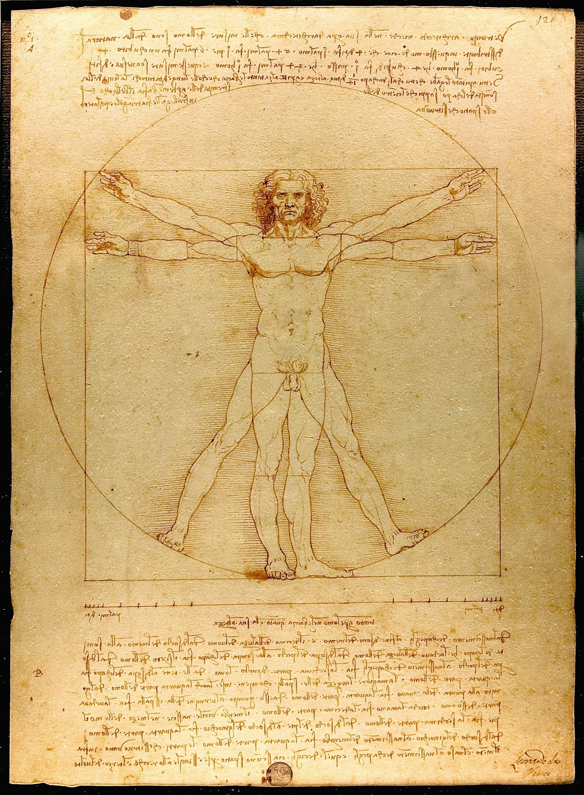
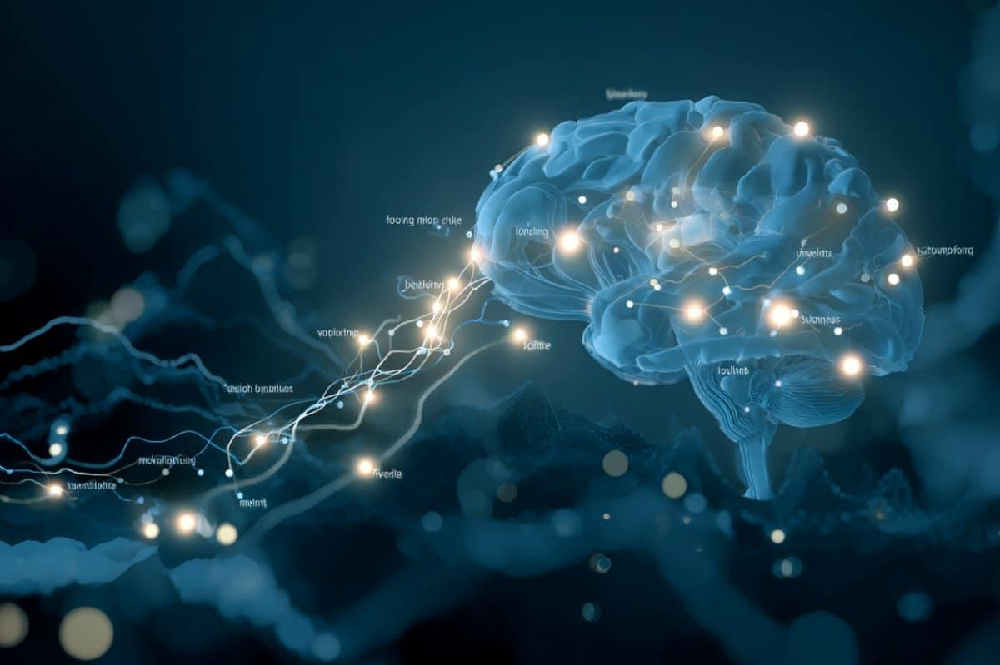

# Medical Science and the Human Body

The most sophisticated machine we know of is the one you are reading this with.

## The body by the numbers

You are made of about 37 trillion cells. Your brain has around 86 billion neurons and
something like 100 trillion connections. Your blood vessels, laid end to end, would run
about 100,000 km, two and a half times around the Earth. Your heart beats roughly 100,000
times a day, about 3 billion times over a life. And you replace most of your cells every 7
to 10 years, which is the same Ship of Theseus point the [philosophy](philosophy.md) page
raises.

## Organs, genes and breakthroughs

Each organ is its own piece of engineering. The liver runs more than 500 chemical functions.
The kidneys filter your whole blood volume around 40 times a day. The immune system remembers
every pathogen it has ever met.

Your DNA is a 3-billion-letter instruction manual coiled into every cell, and since CRISPR
arrived in 2012 we can edit it. The first CRISPR therapy, for sickle-cell disease, was
approved in 2023, curing a genetic illness at its source.

A few breakthroughs changed everything. Anesthesia, in 1846, made real surgery possible.
Antibiotics, from 1928, turned fatal infections routine, though resistance now threatens
that, as the [unsolved medicine](../unsolved/medicine.md) page covers. Vaccines wiped out
smallpox and nearly polio. Organ transplants went from the first heart transplant in 1967 to
routine. And the mRNA platform produced COVID vaccines in months and is now being aimed at
cancer.

## Living longer

Human lifespan has roughly doubled in 150 years, mostly thanks to clean water, vaccines and
antibiotics. The next frontier is healthspan: not just living longer, but staying healthy
while you do, which the [reverse aging](../unsolved/medicine.md) entry gets into. And
regenerative medicine, growing replacement tissue from a patient's own cells, already exists
for bladders and windpipes, with bioprinted organs in development.

Medicine is where impossible turns into routine fastest. A century ago a scraped knee could
kill you. The remaining giants, cancer, aging and dementia, are tracked in
[Unsolved: Medicine](../unsolved/medicine.md).
