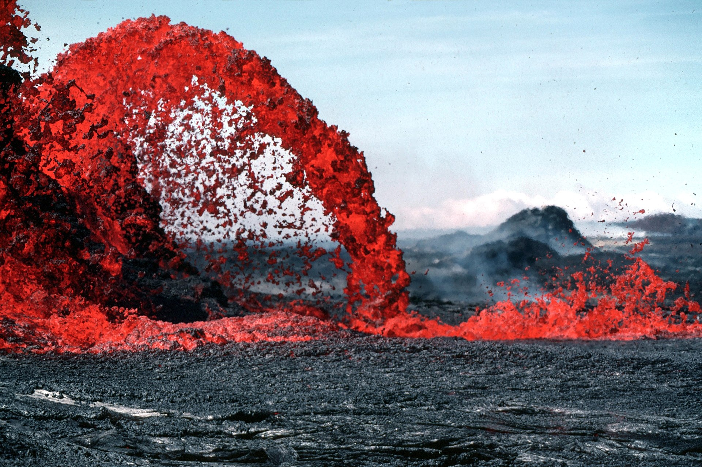

# Earth's Natural Wonders

The planet is the most spectacular engineer of all.

Earth has around 1,500 potentially active volcanoes. They destroy and create at the same
time. They built the Hawaiian Islands, enriched the soil that feeds billions, and released
the gases that formed our atmosphere and oceans. A supervolcano like Yellowstone could shift
the global climate.

The crust is broken into moving plates, and where they grind against each other, energy
builds and then releases. The largest quake ever recorded, in Chile in 1960 at magnitude
9.5, released more energy than thousands of nuclear bombs. Predicting them is still
[unsolved](../unsolved/earth.md).

The Himalayas are still growing about a centimetre a year as India pushes into Asia.
Everest's summit is marine limestone, which was once an ocean floor and is now the roof of
the world.

Son Doong in Vietnam is the largest cave passage on Earth, big enough to hold a 45-storey
building, with its own jungle and clouds inside.

The Sahara is roughly the size of the United States, and just 6,000 years ago it was green,
with lakes and hippos, which shows how sharply Earth's climate can swing.

The Amazon rainforest produces a large share of the world's oxygen and holds around 10% of
all known species. A single hectare can contain more tree species than all of North America.
The Amazon River discharges more water than the next seven largest rivers combined, enough
to freshen the Atlantic 100 km offshore.

Then there is the weather. Lightning is hotter than the surface of the Sun. A hurricane
releases the energy of thousands of nuclear bombs. The auroras are painted by solar wind
hitting the atmosphere. Understanding these forces is not just wonder, it is survival, and
predicting quakes, eruptions and extreme weather are all live
[unsolved](../unsolved/earth.md) problems.
