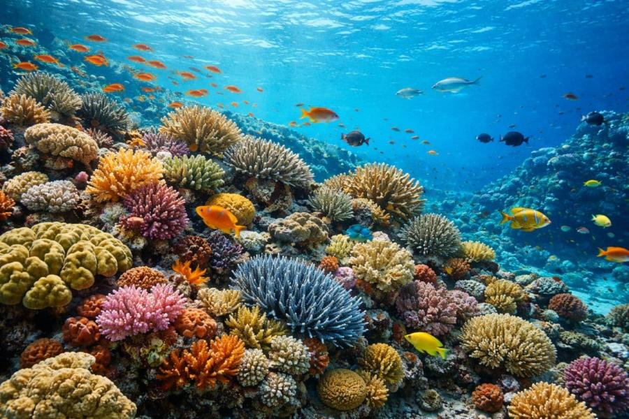
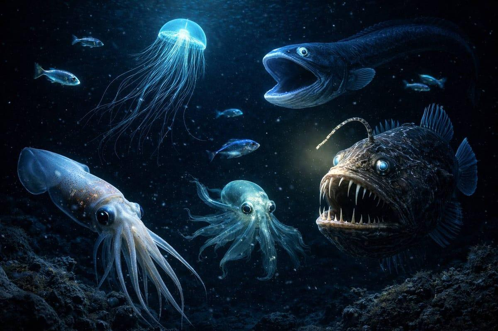
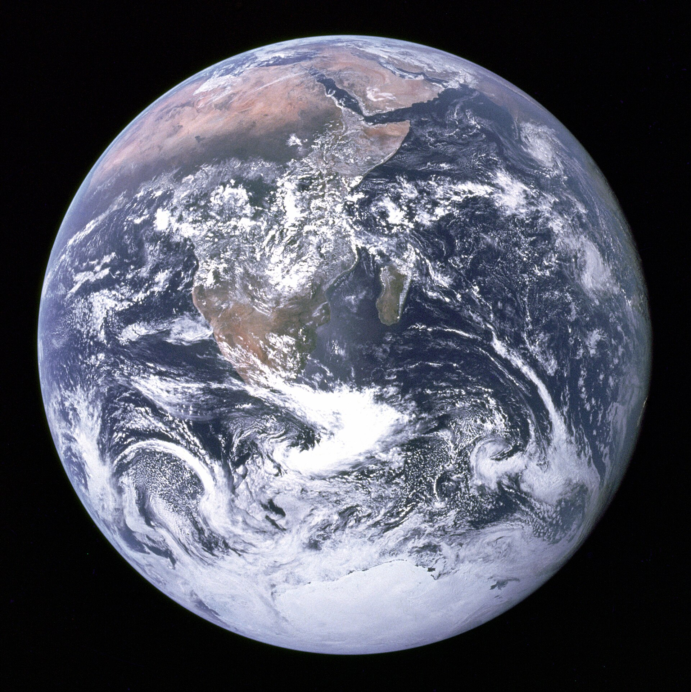

# Oceans and Deep Sea

We have better maps of Mars than of our own sea floor.

## How little we have seen

The ocean covers 71% of the planet, and more than 80% of it is still unmapped and
unexplored. More people have walked on the Moon than have reached the deepest point of the
sea. Scientists think hundreds of thousands of marine species are still undiscovered. And
the ocean produces over half the oxygen you breathe, mostly from tiny plankton rather than
trees.

## Why it matters beyond curiosity

Some of our best medicines come from the sea. Ziconotide, a painkiller far stronger than
morphine and not addictive, comes from cone snail venom. Cancer drugs have come from sea
sponges. Creatures that survive crushing pressure, darkness and near-freezing cold have
evolved chemistry we can learn from.

The ocean also runs the climate. It absorbs around a third of the CO2 we produce and about
90% of the extra heat. And it could power and feed billions through offshore wind, tidal
and wave energy, and sustainable fish farming.

## More worth reading up on

Deep-sea creatures like the anglerfish and giant squid, built for pressure and total dark.
Underwater volcanoes, where most of Earth's volcanic activity actually happens. Shipwrecks
sitting untouched in the cold, from ancient trade ships to the Titanic. And the drones and
submarines slowly mapping a world we have barely seen.

## Still open

Mapping the sea floor, predicting rogue waves, and cleaning up plastic at scale are covered
in [Unsolved: Oceans](../unsolved/oceans.md).

