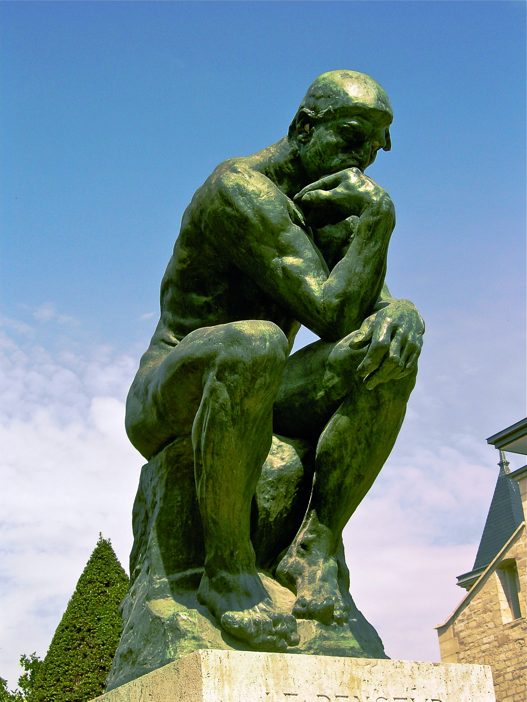

# Philosophy and Philanthropy

Thinking clearly, and turning that into doing some good.

## The big questions

Who are you, really? The Ship of Theseus asks: if every plank of a ship is replaced over
the years, is it still the same ship? Your body swaps out most of its atoms every few
years, so what makes you you? This is also why teleportation is a philosophy problem and
not just a physics one, as the [mind](mind.md) page notes.

How do you know anything? Descartes doubted everything he could and found one thing he
could not doubt: "I think, therefore I am." Science is this idea applied. Every experiment
is really an answer to the question, how would I know if I was wrong?

What is a good life? The Stoics, like Marcus Aurelius and Epictetus, said to focus your
energy on what you can control and let go of what you can't. Modern cognitive therapy is
built on much the same idea. Aristotle argued that happiness is not a feeling but a life of
practised excellence: you become what you repeatedly do.

Some questions still worth chewing on: if an AI said it was conscious, how would we ever
check? Is maths invented or discovered? Does free will exist if the brain runs on physics?

## Philanthropy, thinking that acts

Philosophy asks what is good. Philanthropy tries to answer with action.

Effective altruism asks a sharp question: for the same effort, how much good can I actually
do? A $2 anti-malarial net can matter more than a $200 gesture. Giving away knowledge works
the same way and tends to multiply, which is what Wikipedia, Khan Academy and open-source
software show. This site is a small bet on the same idea. Carnegie built 2,500 libraries;
the modern version is funding vaccines, clean water and open research.

Tek gives you capability and Matu gives you persistence, but the leadership part, Rix, is
measured by what you build for other people. Innovation that helps no one is just
decoration.
