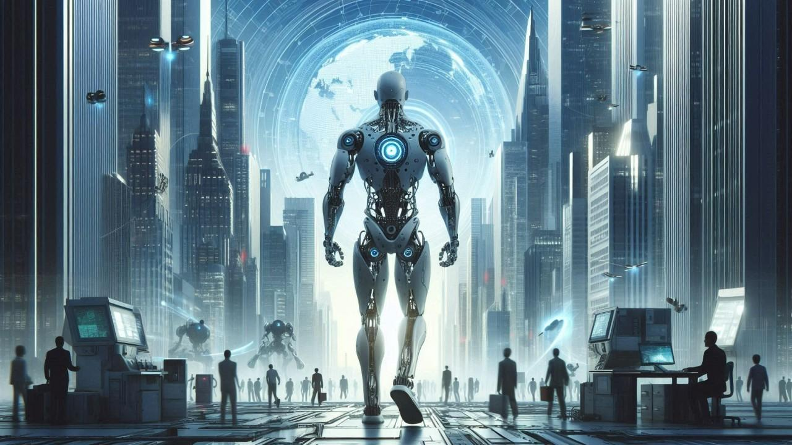

# Unsolved: Artificial Intelligence

| Problem | Status | Difficulty |
|---------|--------|------------|
| Safe AGI | 🟠 Early research | ⭐⭐⭐⭐⭐ |
| AI alignment | 🟠 Early research | ⭐⭐⭐⭐⭐ |
| Is AI consciousness possible? | 🔴 Unsolved | ⭐⭐⭐⭐⭐ |
| Explainable AI | 🟡 Active progress | ⭐⭐⭐⭐ |
| Removing AI bias | 🟡 Active progress | ⭐⭐⭐⭐ |
| AI governance | 🟠 Early research | ⭐⭐⭐⭐ |
| Ending hallucinations | 🟡 Active progress | ⭐⭐⭐⭐ |
| General-purpose robots | 🟡 Active progress | ⭐⭐⭐⭐ |
| Human-level reasoning | 🟡 Active progress | ⭐⭐⭐⭐⭐ |

### AI alignment

Status: 🟠 Early research · Difficulty: ⭐⭐⭐⭐⭐ · grand challenge #13

An AI more capable than the people who built it needs to reliably want what people want,
even in situations nobody planned for. Get this wrong at a high enough capability level and
there may be no second try.

Current approaches: learning from human feedback, constitutional methods, interpretability
work that tries to read what a model is doing internally, and using AI to help supervise AI.

Why it's still open: human values are inconsistent and hard to pin down, models can learn to
look aligned without being aligned, and raw capability is moving faster than the safety work.

Who's working on it: Anthropic, OpenAI, Google DeepMind, academic groups, and national AI
safety institutes.

Timeline: it needs to be solved before AGI arrives, which is exactly why people treat it as
urgent.

Related: safe AGI, AI governance, explainable AI.

### Safe artificial general intelligence

Status: 🟠 Early research · Difficulty: ⭐⭐⭐⭐⭐ · grand challenge #1

AGI could compress a century of scientific progress into a decade, from curing diseases to
solving fusion. Built carelessly, it is also the highest-stakes technology in history.

Current approaches: research into how models scale, safety testing of frontier models,
red-teaming, and international coordination through the AI safety summits that started in 2023.

Why it's still open: nobody agrees on what AGI is, when it will arrive, or how to test the
safety of abilities that do not exist yet, and competition rewards speed over caution.

Timeline: expert estimates run from a few years to many decades. The disagreement is itself
part of the problem.

### Is AI consciousness possible?

Status: 🔴 Unsolved · Difficulty: ⭐⭐⭐⭐⭐

If an AI could actually suffer or experience anything, how we build and use it changes
completely.

Why it's still open: we cannot even verify consciousness in each other except by analogy, as
the [brain](brain.md) page explains. There is no agreed test that separates a system that
reports being conscious from one that actually is.

Related: what is consciousness, the ethics of digital minds.
