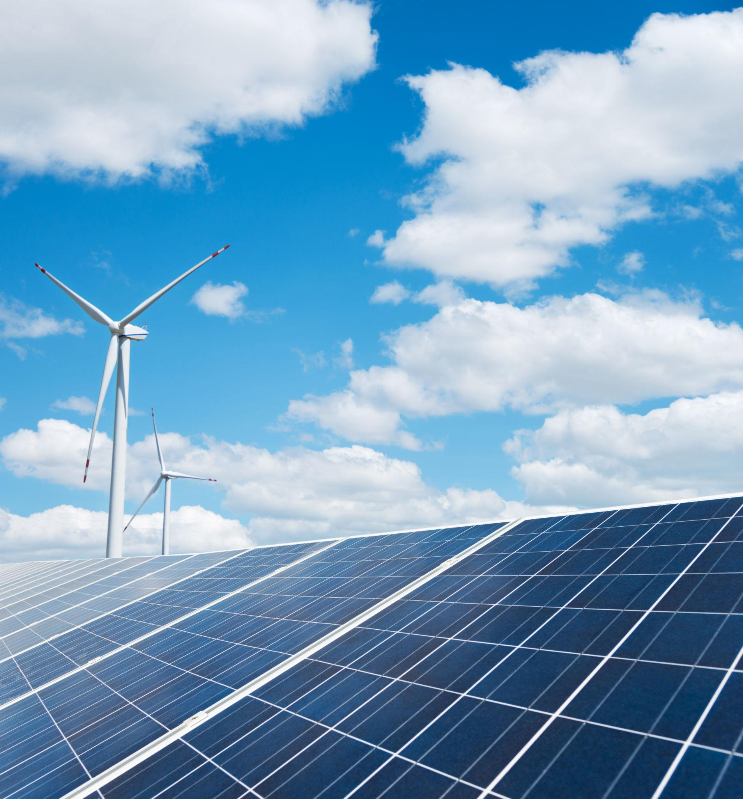
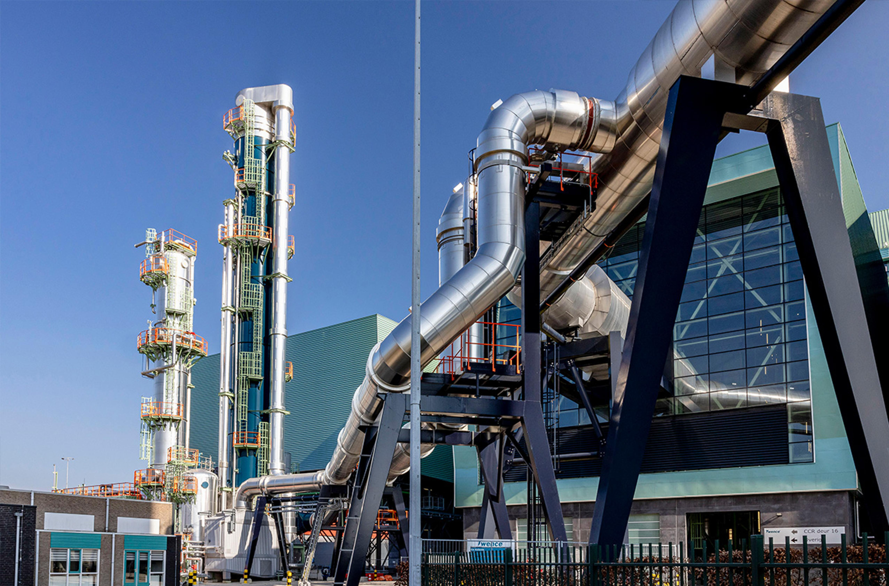
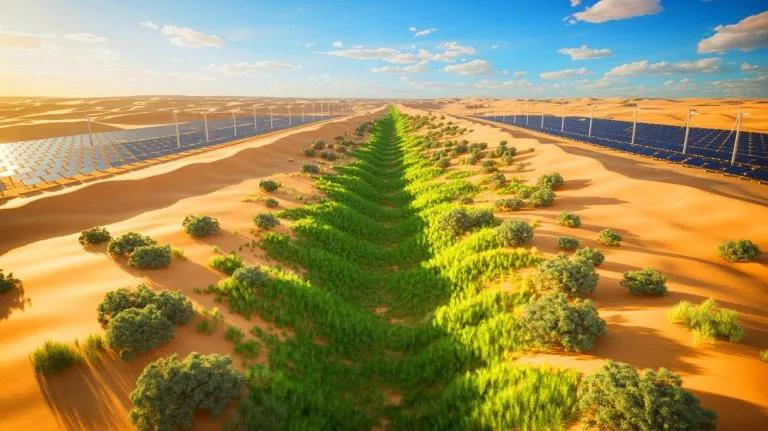

# Unsolved: Earth and Environment

| Problem | Status | Difficulty |
|---------|--------|------------|
| Commercial fusion energy | 🟡 Active progress | ⭐⭐⭐⭐⭐ |
| Carbon removal at scale | 🟠 Early research | ⭐⭐⭐⭐⭐ |
| Climate adaptation | 🟡 Active progress | ⭐⭐⭐⭐⭐ |
| Affordable desalination | 🟡 Active progress | ⭐⭐⭐⭐ |
| Clean water for everyone | 🟡 Active progress | ⭐⭐⭐⭐ |
| Desert greening | 🟠 Early research | ⭐⭐⭐⭐ |
| Restoring biodiversity | 🟠 Early research | ⭐⭐⭐⭐⭐ |
| Plastic alternatives | 🟡 Active progress | ⭐⭐⭐ |
| Removing microplastics | 🔴 Unsolved | ⭐⭐⭐⭐⭐ |
| Sustainable farming | 🟡 Active progress | ⭐⭐⭐⭐ |

### Commercial fusion energy

Status: 🟡 Active progress · Difficulty: ⭐⭐⭐⭐⭐ · grand challenge #2

Fusion is the power source of the stars: near-limitless energy from seawater, no long-lived
radioactive waste, no carbon. It would rewrite both energy and geopolitics.

Current approaches: magnetic confinement, like the giant international ITER tokamak and
private firms using high-temperature superconductors, and laser-driven confinement at the US
National Ignition Facility, plus dozens of startups trying new designs.

Why it's still open: you have to hold a plasma hotter than the Sun's core, get more energy
out than you put in continuously rather than for an instant, and do it cheaply.

Latest: the National Ignition Facility got more energy out of a fusion reaction than the fuel
absorbed in December 2022, and has repeated it. A real milestone, though the whole facility
still used far more power than the reaction released.

Timeline: pilot plants in the 2030s, grid-scale fusion in the 2040s if the milestones hold.
The old joke that it is always 30 years away is finally starting to shrink.

### Affordable desalination

Status: 🟡 Active progress · Difficulty: ⭐⭐⭐⭐

The ocean holds 97% of Earth's water. Making it drinkable cheaply would end water scarcity
for billions on the coasts.

Current approaches: reverse osmosis, which works but uses a lot of energy, newer graphene and
biology-inspired membranes, and pairing plants with renewable power.

Why it's still open: energy cost and brine disposal, since concentrated salt harms marine
life, and inland regions cannot easily use it.

Related: clean water for everyone, ocean farming.

### Carbon removal at scale

Status: 🟠 Early research · Difficulty: ⭐⭐⭐⭐⭐ · grand challenge #9

Cutting emissions is not enough. To hit climate targets we also have to pull CO2 back out of
the air, billions of tonnes a year.

Current approaches: direct air capture with large fans and chemistry, spreading crushed rock
that absorbs CO2, replanting forests, and greening deserts.

Why it's still open: direct air capture today costs hundreds of dollars a tonne and removes
thousands of tonnes, when we need billions of tonnes at a fraction of the cost.

Timeline: real scale needs cost breakthroughs in the 2030s or 2040s.
