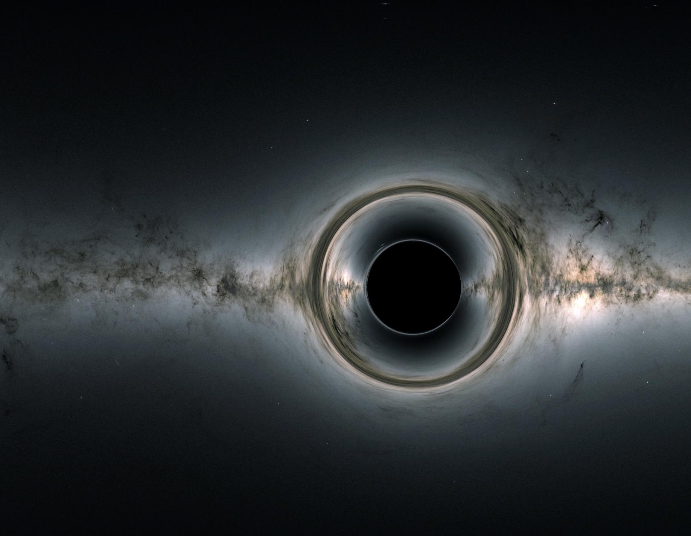

# Unsolved: Space and Astronomy

| Problem | Status | Difficulty |
|---------|--------|------------|
| What is dark matter? | 🔴 Unsolved | ⭐⭐⭐⭐⭐ |
| What is dark energy? | 🔴 Unsolved | ⭐⭐⭐⭐⭐ |
| Are we alone? | 🟠 Early research | ⭐⭐⭐⭐⭐ |
| Where is Planet Nine? | 🟡 Active progress | ⭐⭐⭐ |
| A self-sustaining Mars colony | 🟠 Early research | ⭐⭐⭐⭐⭐ |
| Faster-than-light travel | 🔴 Unsolved | ⭐⭐⭐⭐⭐ |
| Interstellar travel below light speed | 🟠 Early research | ⭐⭐⭐⭐⭐ |
| Warp drive | 🔴 Unsolved | ⭐⭐⭐⭐⭐ |
| Artificial gravity in spacecraft | 🟠 Early research | ⭐⭐⭐ |
| Detecting alien intelligence | 🟠 Early research | ⭐⭐⭐⭐ |

### What is dark matter?

Status: 🔴 Unsolved · Difficulty: ⭐⭐⭐⭐⭐

Galaxies spin too fast to hold together on the gravity of the matter we can see. Something
invisible makes up about 27% of the universe, and we do not know what it is.

Current approaches: underground detectors like LUX-ZEPLIN and XENONnT hunting for particles,
the Large Hadron Collider, and telescopes mapping how gravity bends light.

Why it's still open: decades of ever more sensitive detectors have found nothing. Either the
particle is stranger than we thought, or our theory of gravity itself is wrong.

Latest: the Euclid space telescope, launched in 2023, is building the largest 3D
dark-matter map ever made.

Timeline: genuinely unknown. Could be next year, could be a century.

Related: dark energy, quantum gravity.

### Are we alone?

Status: 🟠 Early research · Difficulty: ⭐⭐⭐⭐⭐

Either answer changes how humanity sees itself.

Current approaches: the James Webb telescope reading exoplanet atmospheres for signs of
life, Mars sample return, missions to icy moons like Europa Clipper (arriving around 2030),
and SETI scanning for signals.

Why it's still open: a single microbe would settle it, but life may be rare, hidden under
ice, or chemically unfamiliar. And absence of evidence is hard to read, which is the heart
of the Fermi paradox.

Latest: Webb has found carbon-based molecules in exoplanet atmospheres, though the possible
life signatures remain contested.

Timeline: microbial evidence is plausible within 10 to 30 years. Intelligent life, no one
can say.

### A self-sustaining Mars colony

Status: 🟠 Early research · Difficulty: ⭐⭐⭐⭐⭐

A second home would make our civilization far more resilient.

Current approaches: SpaceX Starship for moving cargo, NASA Artemis using the Moon as a
proving ground first, and experiments like MOXIE, which made oxygen from Martian air in 2021.

Why it's still open: radiation, the effect of 38% gravity on the body over years, growing
food, closed-loop life support, and the psychology of isolation.

Timeline: a first crewed landing is possible in the 2030s. A colony that can sustain itself
is a 50 to 100 year project.

Related: artificial gravity, closed-loop farming.
